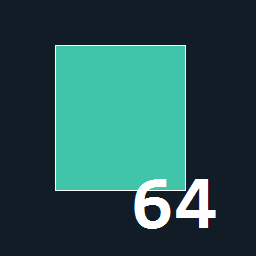

# Player Inventory Stacks

[Download the install ZIP](https://github.com/N0x1/PlanetCrafter-PlayerInventoryStacks/releases/tag/v1.0.0)

A single-purpose BepInEx 5 mod for The Planet Crafter. Matching items stack to **64 in player backpacks only**, with a small white quantity at the bottom right of each stack. The 65th item starts another slot. Single items have no number, like Minecraft.

Chests, storage containers, machines, vehicles and equipped-item slots keep their normal capacity and one-item-per-slot behavior. Items with different saved state (such as DNA, names or charge) remain separate. Carried objects that own another inventory also remain separate.

## Install with r2modman

1. Select **The Planet Crafter** and your profile in r2modman.
2. Install **BepInExPack by BepInEx**, version **5.4.2305** or later, from the Online list. This is the mod loader, not another gameplay mod. [Official package](https://thunderstore.io/c/the-planet-crafter/p/BepInEx/BepInExPack/).
3. Use **Import local mod** and select `PlayerInventoryStacks-1.0.0.zip`. Depending on r2modman version, this is under the Profile menu / Import-Update or Settings / Profile.
4. Click **Start modded**.

If local ZIP import is unavailable, use r2modman's **Browse profile folder**, then copy the supplied `PlayerInventoryStacks.dll` into `BepInEx/plugins/PlayerInventoryStacks/`. Install the loader in step 2 first. Do not put this DLL in the game's Managed folder.

## Moving and using items

- **Left-click:** moves one item. A backpack stack of 64 becomes 63, and the chest receives one item in one slot.
- **Shift + left-click**, or the game's configured **accessibility key + left-click:** uses the game's transfer-all-matching-items action, stopping when the destination cannot accept more. A stack of 64 becomes 54 when filling an empty ten-slot chest. If several backpack stacks contain the same item type, this action can transfer from all of them, as in the base game.
- Moving items back into the backpack combines compatible items up to 64 per slot.
- Consume, drop, equipment actions, sorting, and Move All retain their normal controls. Consuming or dropping a displayed item acts on one item.
- **Tab, then right-click water, food, or an oxygen refill:** consumes exactly one item when the game accepts its use (64 becomes 63), refreshes the quantity, and clears the slot when its final item is consumed. The game's usual full-gauge restrictions still apply.

